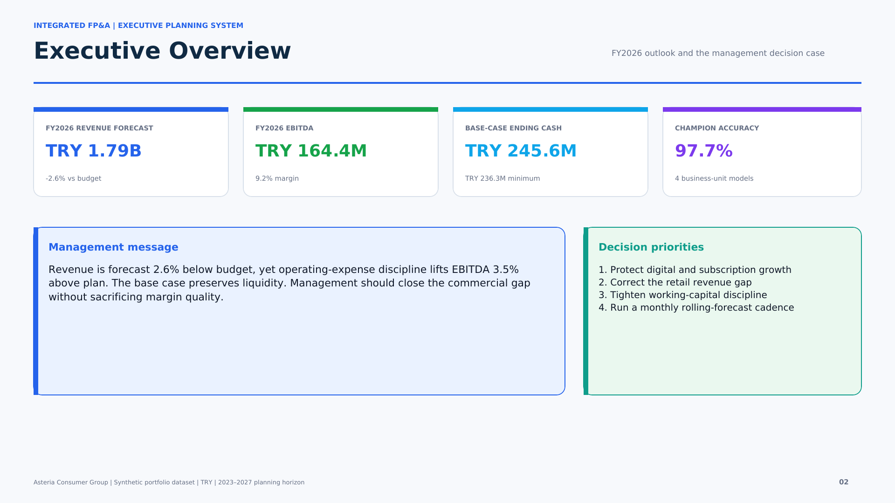
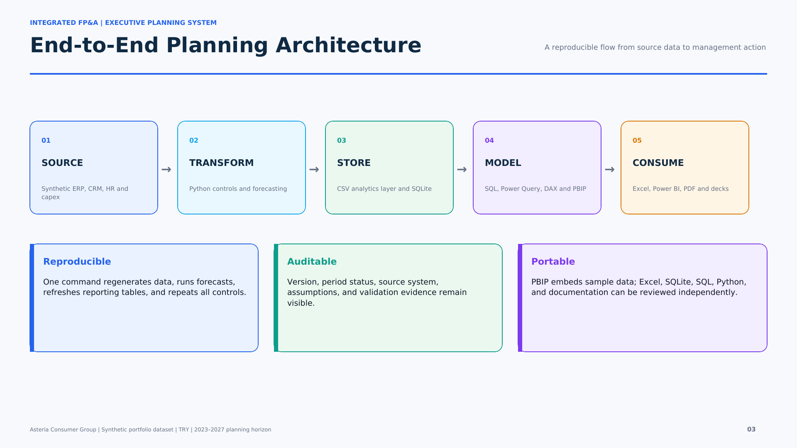
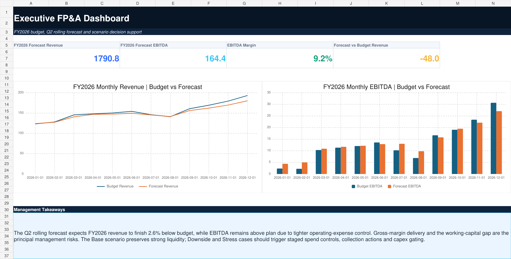
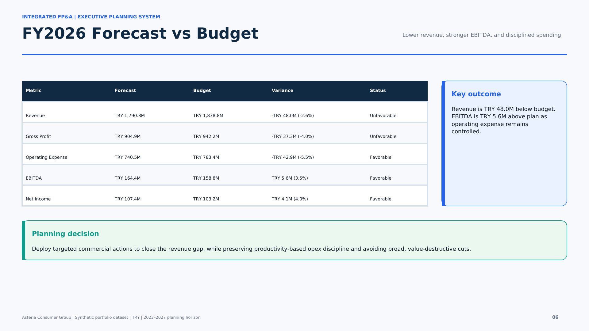
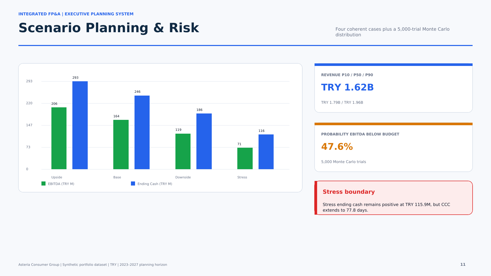

# Integrated FP&A Budgeting, Forecasting & Scenario Planning System



An end-to-end Financial Planning & Analysis portfolio project that connects historical actuals, the FY2026 budget, an 18-month rolling forecast, P&L, cash flow, working capital, workforce, capex, scenario planning, and Monte Carlo risk analysis in one governed decision framework.

The solution is built around a fictional company, **Asteria Consumer Group**, using fully synthetic data. It is designed to demonstrate professional FP&A, business intelligence, financial modeling, statistical forecasting, data engineering, and executive communication skills without exposing confidential business information.

## Executive outcome

| FY2026 planning indicator | Result |
|---|---:|
| Revenue forecast | TRY 1.79B |
| Revenue variance vs budget | -2.6% |
| EBITDA forecast | TRY 164.4M |
| EBITDA variance vs budget | +3.5% |
| EBITDA margin | 9.2% |
| Base-scenario ending cash | TRY 245.6M |
| Average champion-model accuracy | 97.7% |
| Probability EBITDA finishes below budget | 47.6% |

The forecast indicates that disciplined operating expenditure can keep EBITDA above plan despite a revenue shortfall. The primary management challenge is therefore to close the commercial gap while preserving margin quality and liquidity.

## Business problem

Traditional planning processes often separate budget files, actual reporting, departmental submissions, cash planning, and forecast models. That fragmentation slows decisions and creates competing versions of the truth.

This project answers five management questions:

1. How is actual performance tracking against budget?
2. What is the updated 18-month outlook?
3. Which commercial and cost drivers explain the variance?
4. How resilient are EBITDA and cash under downside conditions?
5. Which actions should management prioritize next?

## Project scope

- 42 months of actual history: January 2023–June 2026
- FY2026 departmental and business-unit budget
- 18-month rolling forecast: January 2026–June 2027
- Revenue-driver, headcount, payroll, capex, working-capital, and cash-flow models
- Four coherent scenarios: Upside, Base, Downside, and Stress
- 5,000-trial Monte Carlo simulation
- Four business-unit champion forecasting models
- 17 automated financial and data-quality controls

## Technology stack

| Layer | Tools |
|---|---|
| Data generation and analytics | Python, pandas, NumPy, scikit-learn, statsmodels |
| Database and querying | SQLite, SQL, analytical views |
| Financial planning | Microsoft Excel, Power Query-ready tables, formula-driven controls |
| Business intelligence | Power BI, PBIP, DAX, semantic modeling |
| Executive reporting | PowerPoint, vector PDF, HD portfolio images |
| Quality and automation | Pytest, Ruff, GitHub Actions, Make |

## Solution architecture



The pipeline creates source-level finance and operating data, validates it, produces budget and forecast outputs, writes reporting tables and a SQLite database, and then generates the Excel, Power BI, PowerPoint, PDF, and image deliverables.

Detailed architecture: [Docs/methodology.md](Docs/methodology.md)

## Deliverables

### Excel FP&A model

The workbook contains 31 sheets covering the executive dashboard, scenario controls, income statement, budget variance, rolling forecast, revenue drivers, opex, cash flow, working capital, workforce, capex, model performance, risk analysis, assumptions, checks, and source tables.

[Open the Excel model](Excel/Integrated_FP&A_Budgeting_Forecasting_Scenario_Planning_Model.xlsx)



### Power BI PBIP project

The PBIP package contains an embedded sample-data semantic model, 40 reusable DAX measures, 9 model tables, 3 relationships, 11 report pages, and 89 visuals. It does not require a local CSV path remap when opened.

- [Open the PBIP project folder](PowerBI/Integrated_FPA_PBIP/)
- [Download the packaged PBIP ZIP](PowerBI/Integrated_FPA_Planning_PBIP.zip)
- [Review the DAX measure catalog](PowerBI/Integrated_FPA_Measures.dax)

Report pages:

1. Executive Overview
2. Revenue & Margin
3. P&L Waterfall
4. Budget vs Actual
5. Rolling Forecast
6. Department Performance
7. Business Unit Analysis
8. Cash & Working Capital
9. Operating Expense
10. Long-Range Trends
11. Scenario Planning & Risk

### Executive presentations

- [English 20-slide deck](Presentation/Integrated_FPA_Budgeting_Forecasting_Scenario_Planning_Professional_Deck_EN.pptx)
- [Turkish 20-slide deck](Presentation/Entegre_FPA_Butceleme_Tahminleme_Senaryo_Planlama_Profesyonel_Sunum_TR.pptx)

### Vector executive report

[Open the 12-page vector HD report](Reports/Integrated_FPA_Executive_Report_12_Page_Vector_HD.pdf)



## Forecasting and scenario design

Forecast models are evaluated by MAE, RMSE, WAPE, bias, and a combined governance score. One champion is selected for each business unit:

| Business unit | Champion model | WAPE |
|---|---|---:|
| Digital Commerce | Linear Trend + Seasonality | 1.0% |
| Retail Stores | Linear Trend + Seasonality | 2.8% |
| Subscription Services | Log-Ridge Seasonal | 3.6% |
| Wholesale | Log-Ridge Seasonal | 1.7% |

The scenario engine changes revenue, price/mix, gross margin, operating expense, DSO, DIO, DPO, capex, and cash assumptions as a coherent set. It therefore measures the combined P&L and liquidity impact instead of changing one KPI in isolation.



## Financial controls

All **17 of 17** automated controls pass, including:

- actual, budget, and rolling-forecast coverage
- chart-of-accounts and cost-center referential integrity
- gross profit, EBITDA, and net-income identities
- cash roll-forward
- net-working-capital identity
- expected scenario ordering
- one champion forecast model per business unit
- approved budget submissions
- non-negative capex schedules
- exactly 5,000 finite Monte Carlo trials

See [Docs/quality_assurance.md](Docs/quality_assurance.md) and [Data/validation_report.json](Data/validation_report.json).

## Repository structure

```text
.
├── Data/               Synthetic source and analytical output tables
├── Docs/               Methodology, governance, guides, and portfolio copy
├── Excel/              Formula-driven FP&A model
├── Images/             1080p portfolio and report images
├── Notebooks/          Reproducible analysis notebook
├── PowerBI/            PBIP project, ZIP, and DAX catalog
├── Presentation/       English and Turkish 20-slide decks
├── Python/             Planning, forecasting, reporting, and validation code
├── Reports/            12-page vector executive PDF
├── SQL/                Schema, analytical views, queries, and SQLite database
└── Tools/              Artifact builders
```

## Reproduce the project

Python 3.12 and Node.js are recommended.

```bash
python -m venv .venv
source .venv/bin/activate
pip install -r requirements.txt
make pipeline
make test
```

Optional artifact builds:

```bash
make excel
make pbip
make presentations
make report
```

The generated Excel, PBIP, PowerPoint, and PDF files are already included for portfolio review.

## Documentation

- [Executive summary](Docs/executive_summary.md)
- [Methodology and architecture](Docs/methodology.md)
- [Data dictionary](Docs/data_dictionary.md)
- [KPI dictionary](Docs/kpi_dictionary.md)
- [Forecast model governance](Docs/forecast_model_governance.md)
- [Scenario methodology](Docs/scenario_methodology.md)
- [Excel user guide](Docs/excel_guide.md)
- [Power BI user guide](Docs/power_bi_guide.md)
- [Quality assurance](Docs/quality_assurance.md)
- [LinkedIn project description](Docs/linkedin_project_description.md)
- [GitHub publishing guide](Docs/github_publishing_guide.md)

## Disclaimer

All organizations, transactions, values, and management observations in this repository are synthetic and were created solely for educational and portfolio use. They do not represent the confidential data or performance of a real company.

## Author

**Murat Miraç Gedik**  
FP&A • Business Intelligence • Forecasting • SQL • Python • Power BI • Microsoft Excel
